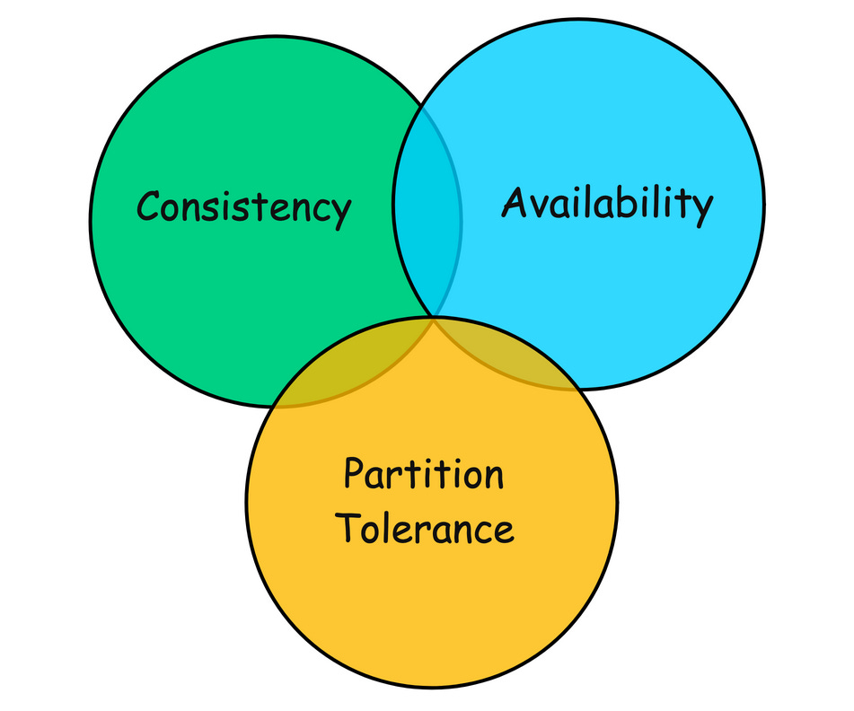
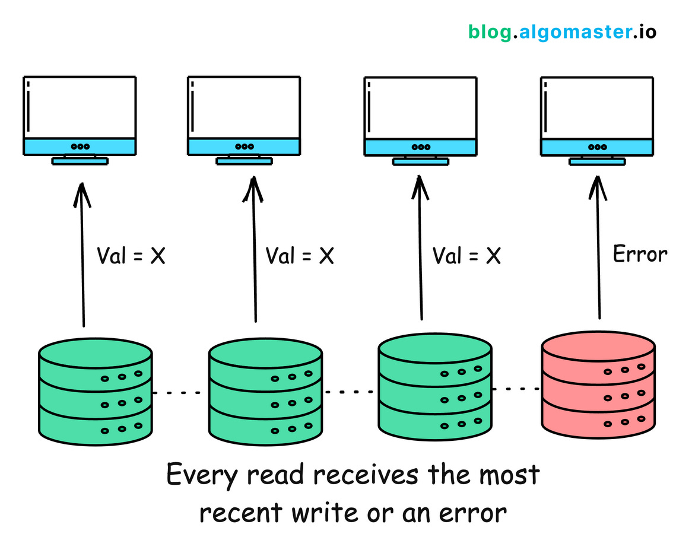
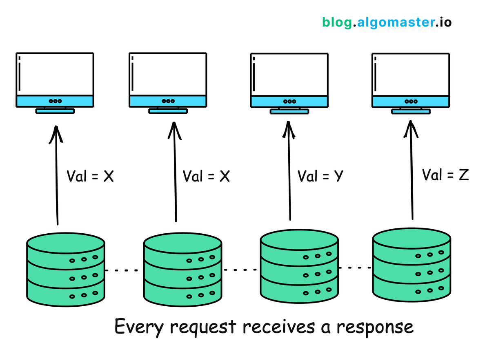
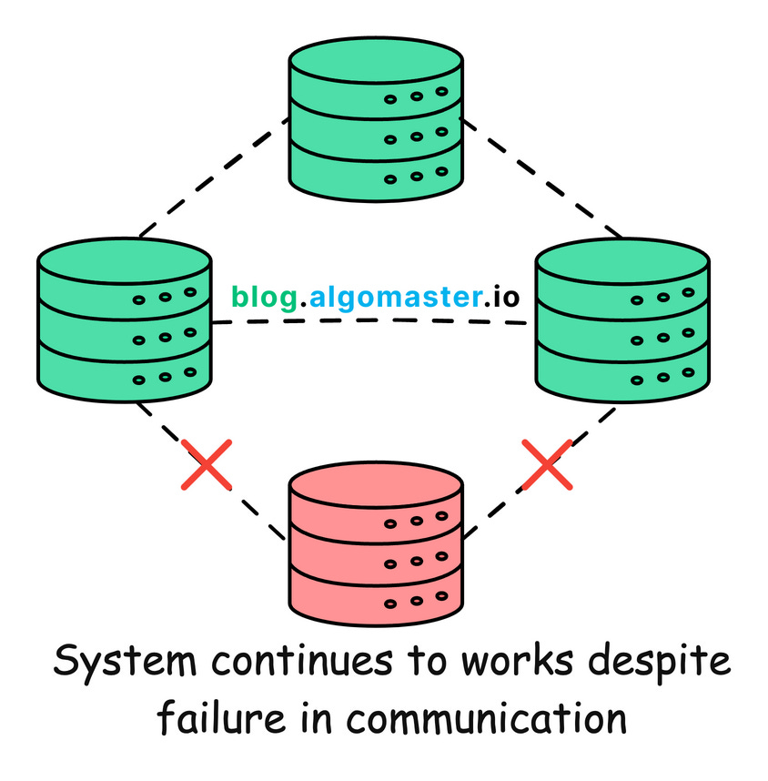

# CAP Theorem

CAP stands for Consistency, Availability, and Partition Tolerance. It's a fundamental framework for understanding the trade-offs that must be made when designing distributed systems.

## Consistency (C)

Consistency ensures that every read receives the most recent write or an error. This means that all working nodes in a distributed system will return the same data at any given time.

## Availability (A)

Availability guarantees that every request (read or write) receives a response, without ensuring that it contains the most recent write. This means that the system remains operational and responsive, even if the response from some of the nodes doesn’t reflect the most up-to-date data.

## Partition Tolerance (P)

Partition Tolerance means that the system continues to function despite network partitions where nodes cannot communicate with each other.

## The CAP Trade-Off: Choosing 2 out of 3

In a distributed system, you can only achieve two out of the three guarantees at any given time:

1. **Consistency and Partition Tolerance (CP)**
2. **Availability and Partition Tolerance (AP)**
3. **Consistency and Availability (CA)**

## Practical Design Strategies

### 1. Eventual Consistency

For many systems, strict consistency isn't always necessary. Eventual consistency can provide a good balance where updates are propagated to all nodes eventually, but not immediately.

**Example**: Systems where immediate consistency is not critical, such as DNS and content delivery networks (CDNs).

### 2. Strong Consistency

A model ensuring that once a write is confirmed, any subsequent reads will return that value.

**Example**: Systems requiring high data accuracy, like financial applications and inventory management.

### 3. Tunable Consistency

Tunable consistency allows systems to adjust their consistency levels based on specific needs, providing a balance between strong and eventual consistency. Systems like Cassandra allow configuring the level of consistency on a per-query basis, providing flexibility.

**Example**: Applications needing different consistency levels for different operations, such as e-commerce platforms where order processing requires strong consistency but product recommendations can tolerate eventual consistency.

### 4. Quorum-Based Approaches

Quorum-based approaches use voting among a group of nodes to ensure a certain level of consistency and fault tolerance.

**Example**: Systems needing a balance between consistency and availability, often used in consensus algorithms like Paxos and Raft.

## Beyond CAP: PACELC

While CAP is foundational, it doesn't cover all scenarios. Daniel Abadi proposed the PACELC theorem as an extension by introducing latency and consistency as additional attributes of distributed systems.

- If there is a partition (P), the trade-off is between availability and consistency (A and C).
- Else (E), the trade-off is between latency (L) and consistency (C).