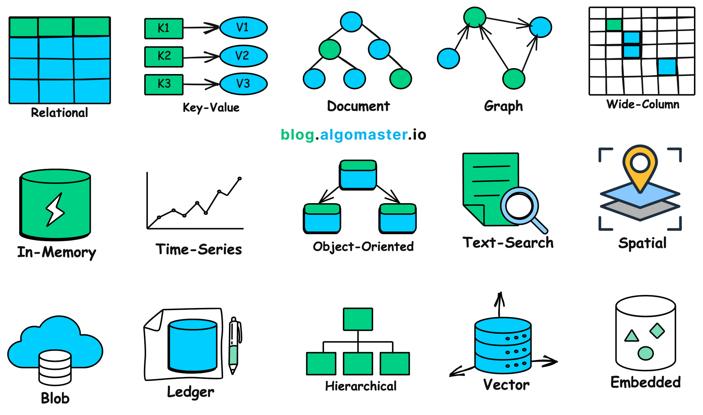

# Database

## Relational Database (SQL)
Database that stores data in a structured format, it relies on a relational model.

**Examples**: MySQL, PostgreSQL, Oracle Database.

## Key-Value (NoSQL)
Databases that store data as key-value pairs providing fast retrieval of values based on unique keys.

**Examples**: Redis, DynamoDB.

## Document Databases (NoSQL)
Databases that store, manage, and retrieve document-oriented information.

**Examples**: MongoDB, Couchbase, and Apache CouchDB

## Graph Databases (NoSQL)
Database represent data as graphs, consisting of nodes (entities), edges (relationships between entities), and properties (information associated with nodes and edges).

By leveraging the graph structure, graph databases enable efficient traversal, querying, and analysis of interconnected data.

**Examples**: Neo4j, Amazon Neptune.

## Wide-Column Stores - Column Family Model (NoSQL)
Database that optimized for storing and querying large amounts of data across many machines.

**Examples**: Apache Cassandra, Apache HBase, Google Bigtable.

## In-Memory Databases
Databases store data directly in the main memory, extremely fast data access and low latency

**Examples**: Redis, Memcached.

## Time-Series Databases
Databases specialize in storing, retrieving time-series data which is a sequence of data points collected over time intervals.

**Examples**: InfluxDB, TimescaleDB, Prometheus.

## Object-Oriented Databases
Database particularly well-suited for applications where complex data models are necessary, or the application logic heavily relies on object-oriented principles.

**Examples**: ObjectDB, db4o

## Text Search Databases
Text Search Databases are specialized systems designed for efficient storage, indexing, and retrieval of large volumes of unstructured or semi-structured text data.

**Examples**: Elasticsearch, Apache Solr, Sphinx.

## Spatial Databases
Databases are designed to store, manage, and analyze data that represents geographical or spatial information. Based on the user's location, such as mapping routes, finding nearby restaurants, or tracking vehicle movements in real-time.

**Examples**: PostGIS (extension for PostgreSQL), Oracle Spatial.

## Blob (Binary Large Object) Datastore (Object Storage)
Database are designed for storing, managing, and retrieving large blocks of unstructured data.

**Examples**: Amazon S3, Azure Blob Storage, HDFS.

## Ledger Databases
Ledger databases also known as blockchain databases are designed to provide an immutable, append-only record of transactions.

**Examples**: Amazon Quantum Ledger Database (QLDB), Hyperledger Fabric.

## Hierarchical Databases
Hierarchical databases organize data into a tree-like structure where data is stored in records, and each record has a single parent record but can have a multiple children, establishing a one-to-many relationship between records.

**Examples**: File Structure.

## Vector Databases
Vector databases are specialized databases designed for storing and searching vectors which are arrays of numbers representing data in high-dimensional spaces. Optimized for similarity search and nearest neighbor queries

**Examples**: Faiss, Milvus, Pinecone.

## Embedded Databases
Embedded databases are specialized databases designed to be tightly integrated into software applications.

**Examples**: SQLite, RocksDB, Berkeley DB, LevelDB, BadgerDB.