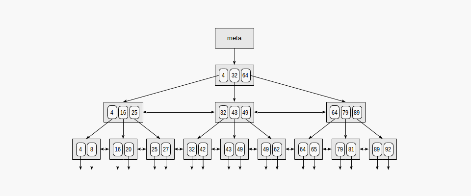
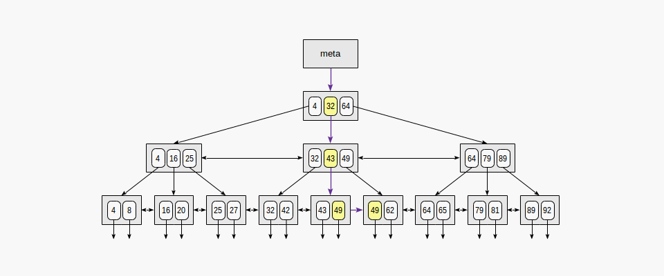
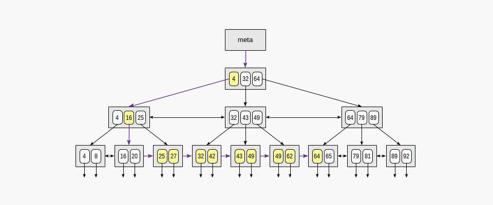

# Indexing in Database Systems

## Introduction

Indexing is a critical concept in database systems that enhances the speed of data retrieval operations. An index is a data structure that improves the performance of queries by allowing the database management system (DBMS) to find rows more quickly than scanning the entire table. This document provides a comprehensive overview of indexing, its types, benefits, and best practices for involved in database design and optimization.

## Key Concepts

### 1. What is an Index?

An index is a data structure that maintains a mapping from the values of one or more columns to the corresponding rows in a database table. It allows the DBMS to quickly locate data without scanning the entire table.

### 2. Why Use Indexes?

Indexes are used to:
- **Speed Up Query Performance**: Reduce the time taken for data retrieval operations, especially for large datasets.
- **Enhance Sorting and Filtering**: Improve the performance of ORDER BY and WHERE clauses in SQL queries.
- **Support Unique Constraints**: Ensure that values in a column are unique, providing faster access to records.

## Types of Indexes

Indexes can be classified into several types based on their structure and usage:

### 1. B-Tree Index

- **Description**: The most common type of index, B-Tree (Balanced Tree) indexes maintain a balanced tree structure, allowing for efficient searching, insertion, and deletion operations.
- **Usage**: Suitable for a wide range of queries, including equality and range queries.
- **Example**: In a `Customers` table, a B-Tree index on the `Age` column allows for fast searches by age.
    
    
    

### 2. Hash Index

- **Description**: Hash indexes use a hash table to map key values to their corresponding row locations. They provide very fast lookups for equality checks but do not support range queries.
- **Usage**: Best for equality comparisons where the exact value is known.
- **Example**: A hash index on a `UserID` column can quickly locate a user by their unique ID.

### 3. Bitmap Index

- **Description**: Bitmap indexes use bit arrays to represent the presence or absence of values in a column. They are particularly effective for columns with a low cardinality (few distinct values).
- **Usage**: Commonly used in data warehousing and analytical queries.
- **Example**: A bitmap index on a `Gender` column (with values 'Male' and 'Female') can efficiently filter records based on gender.

### 4. Full-Text Index

- **Description**: Full-text indexes support complex queries against text data, allowing for efficient searching of words or phrases within text fields.
- **Usage**: Useful for applications that require searching large text fields, like articles or product descriptions.
- **Example**: A full-text index on a `Description` column in a product catalog can enable quick searches for keywords.

### 5. Composite Index

- **Description**: A composite index is an index on multiple columns, allowing for efficient querying based on combinations of those columns.
- **Usage**: Ideal for queries that filter or sort on multiple attributes.
- **Example**: A composite index on `LastName` and `FirstName` can speed up searches for full names.

## Benefits of Indexing

1. **Improved Query Performance**: Significantly reduces the time taken to execute queries by minimizing data scans.
2. **Enhanced Sorting**: Optimizes the performance of ORDER BY clauses, allowing for faster sorting of results.
3. **Efficient Joins**: Speeds up join operations between tables by allowing the DBMS to quickly locate matching rows.

## Drawbacks of Indexing

1. **Increased Storage Requirements**: Indexes consume additional disk space, which can be significant for large tables or multiple indexes.
2. **Slower Write Operations**: Inserting, updating, or deleting records can become slower due to the overhead of maintaining indexes.
3. **Maintenance Overhead**: Indexes require regular maintenance, such as rebuilding or reorganizing, to ensure optimal performance.

## Best Practices for Indexing

1. **Identify Query Patterns**: Analyze the most frequently used queries to determine which columns require indexing. Focus on columns used in WHERE, ORDER BY, and JOIN clauses.
2. **Limit Indexes**: Avoid creating too many indexes on a table, as this can negatively impact write performance. Aim for a balance between read and write efficiency.
3. **Use Composite Indexes Wisely**: Create composite indexes for columns that are frequently queried together, but only when necessary to avoid excessive complexity.
4. **Monitor Index Usage**: Regularly review index usage statistics to identify unused or underutilized indexes, which can be candidates for removal.
5. **Consider Index Types**: Choose the appropriate index type based on the specific use case, such as using a bitmap index for low-cardinality columns or a full-text index for text searches.

## Conclusion

Indexing is a powerful tool for improving the performance of database queries, enabling faster data retrieval and enhancing overall application responsiveness. By understanding the various types of indexes, their benefits and drawbacks, and best practices for implementation, engineers can design efficient database systems that meet performance requirements.

## Further Reading

- **Books**:
  - "Database System Concepts" by Silberschatz, Korth, and Sudarshan.
  - "SQL Performance Explained" by Markus Winand.

- **Online Resources**:
  - Documentation for specific database management systems regarding indexing strategies (e.g., PostgreSQL, MySQL, Oracle).
  - Articles and tutorials on database optimization and indexing techniques.