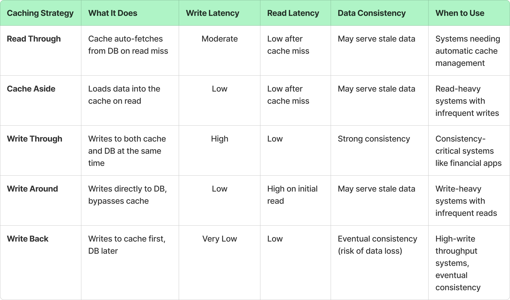

# Caching

Caching is essential for the following reasons:

- **Improved Performance**: By storing frequently accessed data in a cache, the time required to retrieve that data is significantly reduced.
- **Reduced Load on Backend Systems**: Caching reduces the number of requests that need to be processed by the backend, freeing up resources for other operations.
- **Increased Scalability**: Caches help in handling a large number of read requests, making the system more scalable.
- **Cost Efficiency**: By reducing the load on backend systems, caching can help lower infrastructure costs.
- **Enhanced User Experience**: Faster response times lead to a better user experience, particularly for web and mobile applications.

## Types of Caching
- **In-Memory Cache**: MemCache, Redis (single node)
- **Distributed Cache**: Redis Cluster, Amazon ElastiCache
- **Client-Side Cache**: Client-side caching involves storing data on the client device.
- **Database Cache**: Database caching involves storing frequently queried database results in a cache.
- **Content Delivery Network (CDN)**:CDNs cache content at various locations around the world to reduce latency and improve load times for users.

## Cache Eviction Policies
- **LRU Least Recently Used**: LRU evicts the least recently accessed data when the cache is full. It assumes that recently used data will likely be used again soon.
- **MRU Most Recently Used**: MRU evicts the item that was accessed most recently when the cache is full. The idea behind MRU is that the most recently accessed item is likely to be a temporary need and won’t be accessed again soon, so evicting it frees up space for potentially more valuable data.
- **LFU Least Frequently Used**: LFU evicts data that has been accessed the least number of times, under the assumption that rarely accessed data is less likely to be needed.
- **RR Random Replacement**: RR cache eviction strategy is the simplest of all: when the cache is full, it evicts a random item to make space for a new one.
- **FIFO First In, First Out**: FIFO evicts the oldest data in the cache first, regardless of how often or recently it has been accessed.
- **TTL Time-to-Live**: TTL is a time-based eviction policy where data is removed from the cache after a specified duration, regardless of usage.
- **Two-Tiered Caching**: Two-Tiered Caching combines two layers of cache—usually a local cache (in-memory) and a remote cache (distributed or shared).

## Caching Strategies
- **Read-Through Cache**: The application first checks the cache for data. If it's not there (a cache miss), it retrieves the data from the database and updates the cache.
- **Write-Through Cache**: Data is written to both the cache and the database simultaneously, ensuring consistency but potentially impacting write performance.
- **Write-Back Cache**: Data is written to the cache first and later synchronized with the database, improving write performance but risking data loss.
- **Cache-Aside (Lazy Loading)**: The application is responsible for reading and writing from both the cache and the database.

## Challenges and Considerations

- **Cache Coherence**: Ensuring that data in the cache remains consistent with the source of truth (e.g., the database).
- **Cache Invalidation**: Determining when and how to update or remove stale data from the cache.
- **Cold Start**: Handling scenarios when the cache is empty, such as after a system restart.
- **Cache Eviction Policies**: Deciding which items to remove when the cache reaches capacity (e.g., Least Recently Used, Least Frequently Used).
- **Cache Penetration**: Preventing malicious attempts to repeatedly query for non-existent data, potentially overwhelming the backend.
- **Cache Stampede**: Managing situations where many concurrent requests attempt to rebuild the cache simultaneously.
