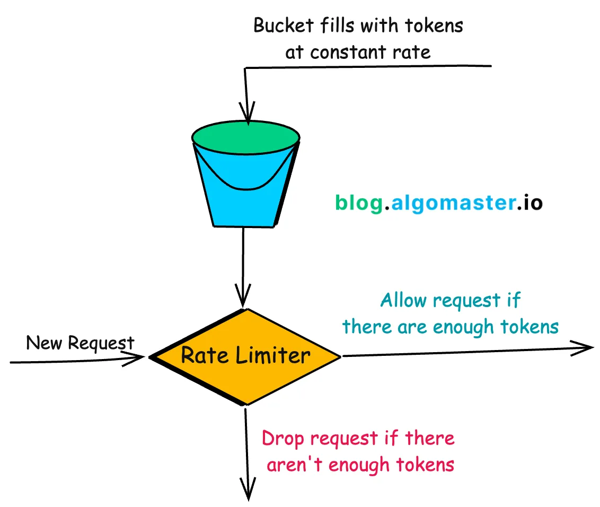
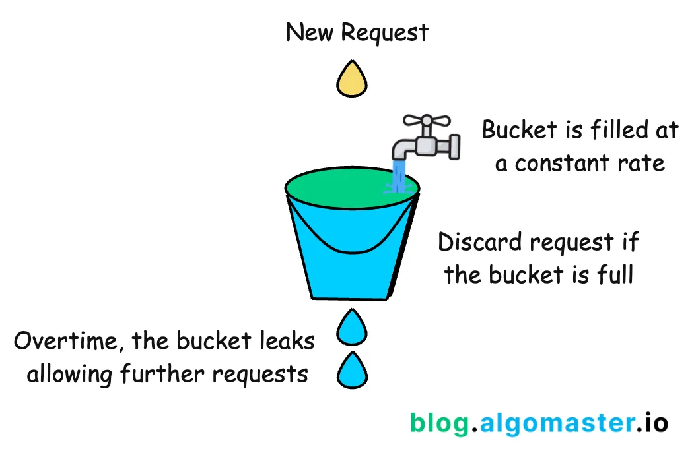
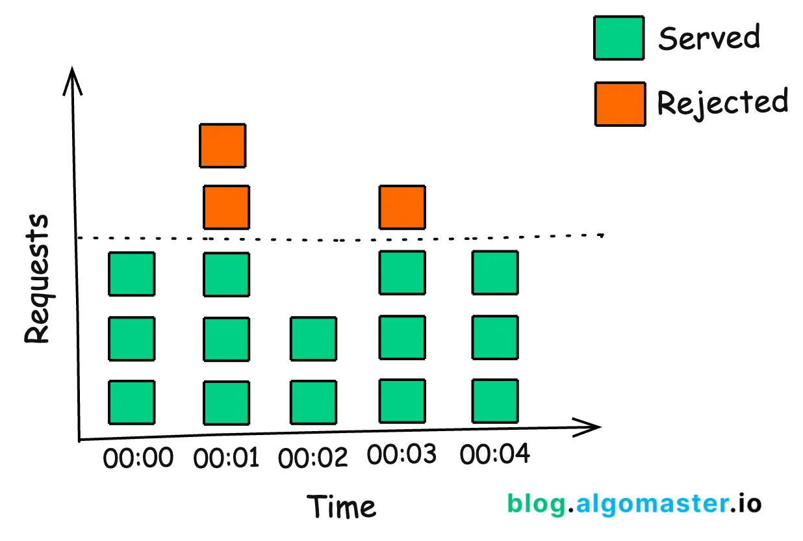
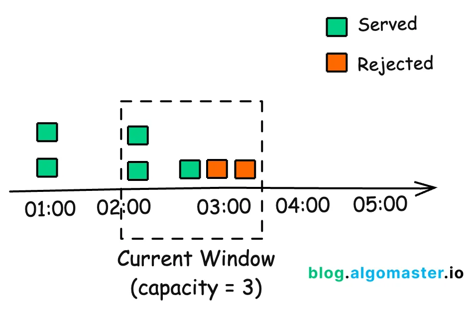
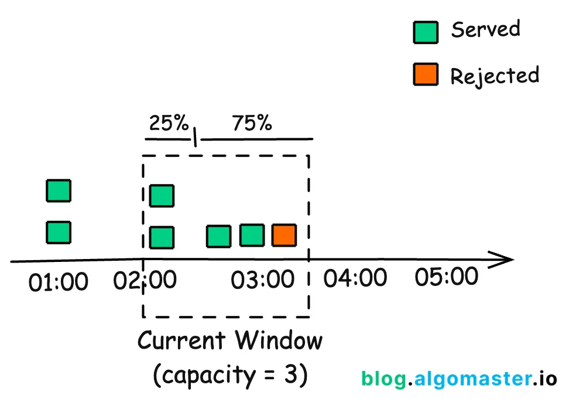

# Token Bucket
The Token Bucket algorithm is one of the most popular and widely used rate limiting approaches due to its simplicity and effectiveness.

### Pros:
Relatively straightforward to implement and understand.

Allows bursts of requests up to the bucket's capacity, accommodating short-term spikes.

### Cons:
The memory usage scales with the number of users if implemented per-user.

It doesn’t guarantee a perfectly smooth rate of requests.

# Leaky Bucket
The Leaky Bucket algorithm is similar to Token Bucket but focuses on smoothing out bursty traffic.

### Pros:
Processes requests at a steady rate, preventing sudden bursts from overwhelming the system.

Provides a consistent and predictable rate of processing requests.

### Cons:
Does not handle sudden bursts of requests well; excess requests are immediately dropped.

Slightly more complex to implement compared to Token Bucket.

# Fixed Windown Counter
The Fixed Window Counter algorithm divides time into fixed windows and counts requests in each window.

### Pros:
Easy to implement and understand.

Provides clear and easy-to-understand rate limits for each time window.

### Cons:
Does not handle bursts of requests at the boundary of windows well. Can allow twice the rate of requests at the edges of windows.

# Sliding Window Log
The Sliding Window Log algorithm keeps a log of timestamps for each request and uses this to determine if a new request should be allowed.

### Pros:
Very accurate, no rough edges between windows.

Works well for low-volume APIs.

### Cons:
Can be memory-intensive for high-volume APIs.

Requires storing and searching through timestamps.

# Sliding Window Counter
This algorithm combines the Fixed Window Counter and Sliding Window Log approaches for a more accurate and efficient solution.

Instead of keeping track of every single request’s timestamp as the sliding log does, it focus on the number of requests from the last window.

So, if you are in 75% of the current window, 25% of the weight would come from the previous window, and the rest from the current one:

weight = (100 - 75)% * lastWindowRequests + currentWindowRequests
Now, when a new request comes, you add one to that weight (weight + 1). If this new total crosses our set limit, we have to reject the request.

### Pros:
More accurate than Fixed Window Counter.

More memory-efficient than Sliding Window Log.

Smooths out edges between windows.

### Cons:
Slightly more complex to implement.

When implementing rate limiting, consider factors such as the scale of your system, the nature of your traffic patterns, and the granularity of control you need.

Lastly, always communicate your rate limits clearly to your API users, preferably through response headers, so they can implement appropriate retry and backoff strategies in their clients.

Reference: algomaster.io