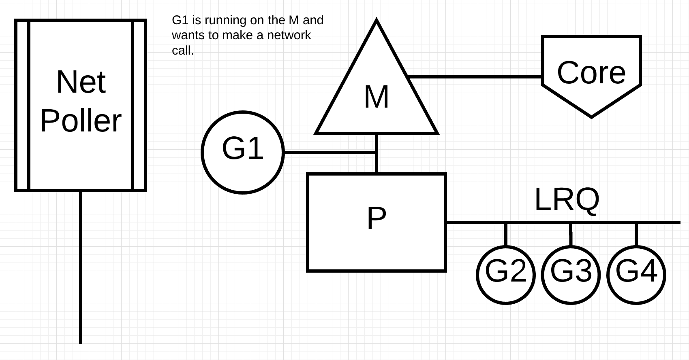

# Go (Golang)

Go is designed for simplicity, efficiency, and reliability, making it an excellent choice for building scalable and high-performance applications.

## Key Features

- **Concurrency**: Go has built-in support for concurrent programming with goroutines and channels.
- **Garbage Collection**: Automatic memory management helps prevent memory leaks and other related issues.
- **Static Typing**: Go is statically typed, which helps catch errors at compile time.
- **Fast Compilation**: Go compiles quickly, making the development process more efficient.
- **Standard Library**: Go has a rich standard library that provides many useful packages for various tasks.

## Go Runtime


- **Lightweight Concurrency**:
Goroutines are much lighter than traditional threads, allowing thousands or even millions of goroutines to run simultaneously without significant overhead.
- **Channels**:
Channels allow goroutines to communicate safely and synchronize their execution. This enables the passing of data between goroutines without explicit locks. Go supports both buffered and unbuffered channels, providing flexibility in how data is exchanged.
- **M:N Scheduling**:
Go uses a sophisticated scheduling model that allows many goroutines to be multiplexed onto a smaller number of operating system threads. This allows for efficient CPU usage and better performance.
- **Cooperating Scheduling**:
The Go scheduler allows goroutines to yield control cooperatively, enabling the runtime to manage goroutines effectively without heavy context switching.
- **Context Switching**:
Go minimizes context switching overhead by using lightweight goroutines, allowing the scheduler to switch between goroutines efficiently.
- **Work Stealing**:
The scheduler employs a work-stealing algorithm, allowing idle threads to "steal" work from busy threads, which helps balance the load and improve performance.
- **IO Non-Blocking**:
Go's runtime is optimized for both I/O-bound and CPU-bound operations. When a goroutine waits for I/O, it is pushed to the net poller instead of blocking the thread. This allows other goroutines to continue execution, improving overall efficiency and responsiveness.


```go
runtime.schedule() {
    // only 1/61 of the time, check the global runnable queue for a G.
    // if not found, check the local queue.
    // if not found,
    //     try to steal from other Ps.
    //     if not, check the global runnable queue.
    //     if not found, poll network.
}
```
