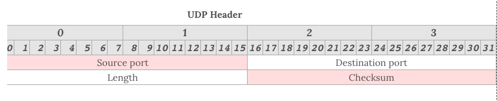
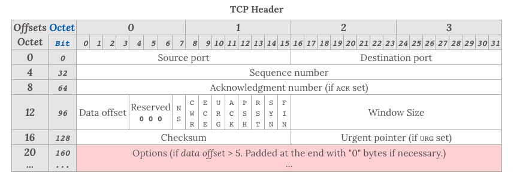
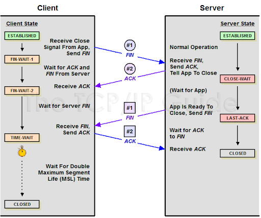
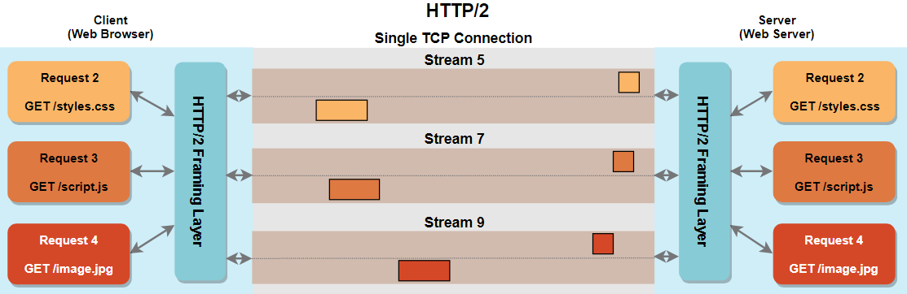

# Network under the hood

## UDP vs. TCP

### UDP (User Datagram Protocol)
- **Connectionless**: No need to establish a connection before sending data.
- **Unreliable**: Does not guarantee delivery or order, making it faster but less reliable.
- **Lightweight**: Lower overhead, suitable for applications like video streaming or gaming where speed is critical.
- **UDP Header**: Header data with only 8 bytes

    
- **Transmission Mode**: The transmission modes of UDP supports unicast, multicast and broadcast.

### TCP (Transmission Control Protocol)
- **Connection-Oriented**: Establishes a connection before data transmission.
- **Reliable**: Guarantees delivery through acknowledgments (ACKs) and retransmissions.
- **Orderly Delivery**: Ensures packets are delivered in the order they are sent.
- **Flow Control**: Manages data transmission rate to prevent overwhelming the receiver.
- **TCP Header**: Header data needs at least 20 bytes

    
- **Three-way handshake in opening connection**

    
    #### Why need the third handshake if the connection can be established after the first two?

    This will prevent the scenario that an invalid request reaches the server and results in wasting server's resource.

    Imagine that, the client sends a connect request called A, but the network is bad so client retransmits another called B. When B reaches the server, the server handles it correctly, and the connection will be established successfully. If A reaches when connect B is closed, the server might think that this is a new request. So the server handles it and enters ESTABLISHED state while the client is closed. This will waste the resource of the server.

    PS: Through connecting, if any end is offline, it needs to retransmit, generally, five times. You can limit the times of retransmitting or reject the request if can't handle it.

- **Four-handshake of disconnect**

    
    #### Why the client should enter TIME-WAIT state for 2MSL before it enters CLOSED state

    This can ensure that the server is enabled to get the ACK from the client. If the client enters CLOSED state immediately, the server may be not able to close correctly for not receiving the ACK with bad network.

- **Congestion Control**: [Reference](https://github.com/InterviewMap/CS-Interview-Knowledge-Map/blob/master/Network/Network_en.md#congestion-control)

    Congestion control is different from flow control. The latter is used in the receiver to ensure that it can handle all data in time. The former is used in the network to avoid network congestion or network overload.

    There are four algorithms in congestion control: Slow-start, Congestion Avoidance, Fast Retransmit and Fast Recovery.

## HTTP Versions

### HTTP/1.0
- **Connection**: Each request/response pair requires a new TCP connection.
- **Persistent Connections**: Not supported; connections are closed after each request.
- **Caching**: Basic caching mechanisms with limited support.
- **Headers**: Limited header support, making it less efficient for modern web needs.

### HTTP/1.1
- **Connection**: Supports persistent connections, allowing multiple requests/responses over a single TCP connection.
- **Chunked Transfer Encoding**: Allows the server to start sending data before knowing the total size.
- **Caching**: Improved caching mechanisms with more header options (e.g., `Cache-Control`).
- **Host Header**: Required to support multiple domains on a single IP address.

### HTTP/2.0
- **Multiplexing**: Allows multiple streams (requests/responses) over a single TCP connection without waiting for each to complete, reducing latency.
- **Frame-Based Protocol**: Breaks messages into smaller frames that can be interleaved.
- **Header Compression**: Uses HPACK to reduce header size, improving efficiency.
- **Server Push**: Enables the server to send resources to the client before they are requested.
- **HTTP 2.0 based on TCP**
  
  

## TLS and SSL

### TLS (Transport Layer Security)
- **Security Protocol**: Provides encryption, data integrity, and authentication for communication over a network.
- **Replaces SSL**: More secure and efficient than its predecessor, SSL.
- **Used with HTTP**: Forms HTTPS, ensuring secure web browsing.

### SSL (Secure Sockets Layer)
- **Older Security Protocol**: Predecessor to TLS; less secure and deprecated.
- **Limited Use**: Some legacy systems may still use SSL, but it's recommended to use TLS.

## Summary
- **HTTP/1.0**: Basic, single-connection protocol.
- **HTTP/1.1**: Improved with persistent connections and better caching.
- **HTTP/2.0**: Advanced multiplexing and header compression for efficiency.
- **TCP**: Reliable, connection-oriented protocol.
- **UDP**: Fast, connectionless protocol with no delivery guarantees.
- **TLS/SSL**: Security protocols for encrypted communication, with TLS being the modern standard.

## Diagram
